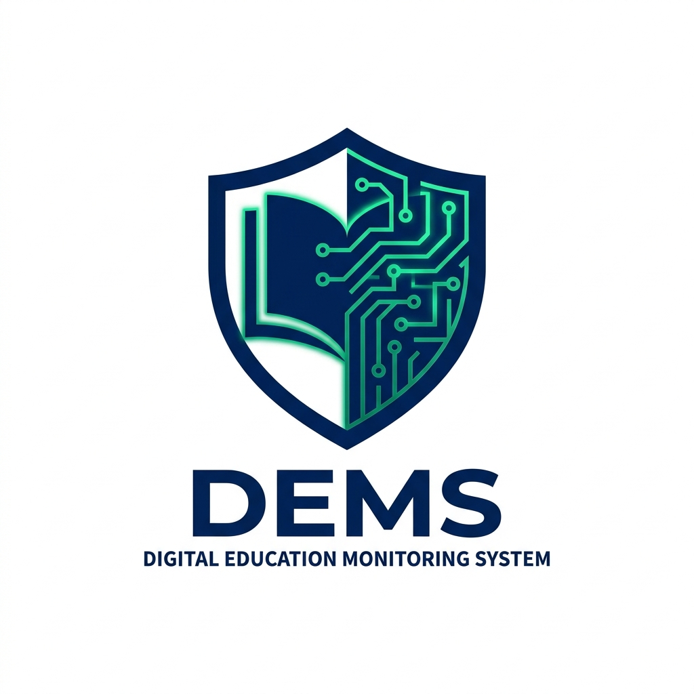
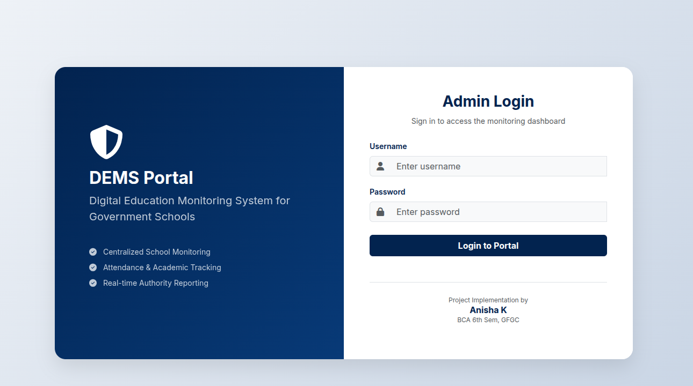
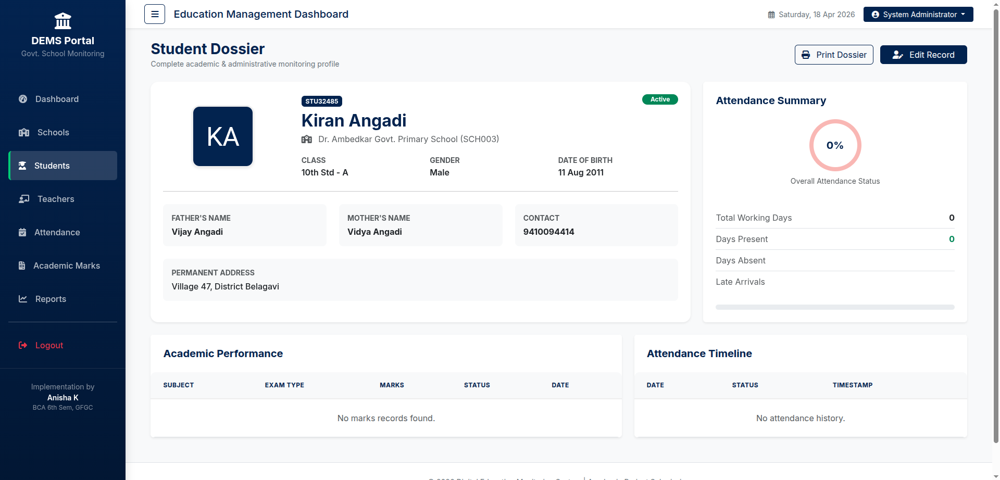
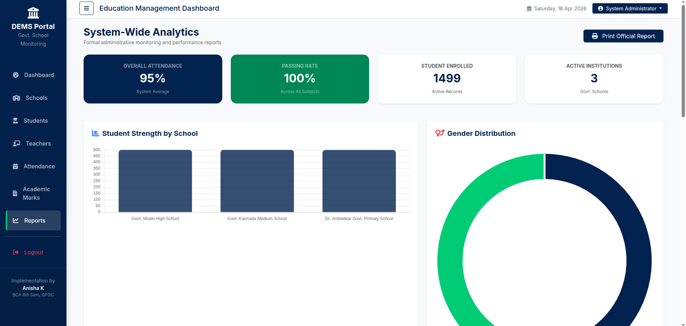
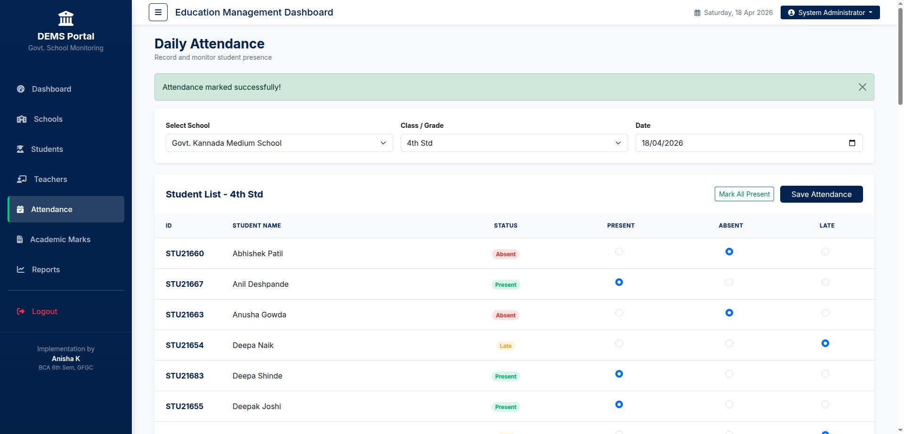
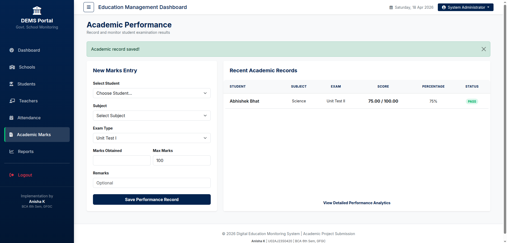

# Digital Education Monitoring System (DEMS)

A comprehensive, production-grade monitoring platform for government schools and education authorities. DEMS is designed for centralized management of student records, teacher allocations, attendance tracking, and academic performance analytics.



## Project Overview
This project serves as a modern digital governance solution to reduce paperwork and improve transparency in school administration. It features a sophisticated administrative dashboard, real-time reporting, and a unique "Student Dossier" system for deep academic monitoring.

## System Screenshots

<div align="center">
  <h3>Administrative Dashboard</h3>
  
  <br><br>
  <table width="100%">
    <tr>
      <td width="50%"><br><i>Student Monitoring Dossier</i></td>
      <td width="50%"><br><i>System-Wide Analytics</i></td>
    </tr>
    <tr>
      <td width="50%"><br><i>Daily Attendance Tracking</i></td>
      <td width="50%"><br><i>Performance Recording</i></td>
    </tr>
  </table>
</div>

## Key Modules
1. **Administrative Dashboard:** Real-time summary of schools, students, and active teachers with data visualization.
2. **School Management:** Regional monitoring of institutions with district-level filtering.
3. **Student Dossier (Core Feature):** A unified profile view showing personal data, attendance percentage, historical timeline, and exam performance.
4. **Attendance Engine:** Daily session-based recording with automated percentage calculations.
5. **Analytics Suite:** Built-in reporting for gender distribution, subject-wise performance, and regional strength.

## Technical Architecture
- **Frontend:** HTML5, CSS3 (Bootstrap 5), JavaScript
- **Backend:** PHP (PDO for Secure Database Access)
- **Database:** MySQL / MariaDB
- **Visuals:** Chart.js for interactive analytics
- **Icons:** Font Awesome 6.x

## Installation and Configuration

### 1. Prerequisites
- XAMPP / WAMP / LAMP installed.
- PHP 7.4 or higher.

### 2. Deployment
1. Clone this repository into your `htdocs` directory:
   ```bash
   git clone https://github.com/rxhtt/Digital-Education-Monitoring-System.git
   ```
2. Open **phpMyAdmin** and create a database named `education_monitoring`.
3. Import the `database.sql` file provided in the project root.
4. Configure `config/db.php` with your database credentials.

### 3. Data Initialization
To populate the system with professional sample data (1500+ records), navigate to:
`http://localhost/DEMS/config/seed.php`

### 4. System Access
- **URL:** `http://localhost/DEMS`
- **Username:** `admin`
- **Password:** `admin123` (Use `reset_admin.php` for credential recovery).

## License
Distributed under the **MIT License**. See `LICENSE` for more information.

## This was an Final Year Project created for a student by Rohit Bagewadi.

